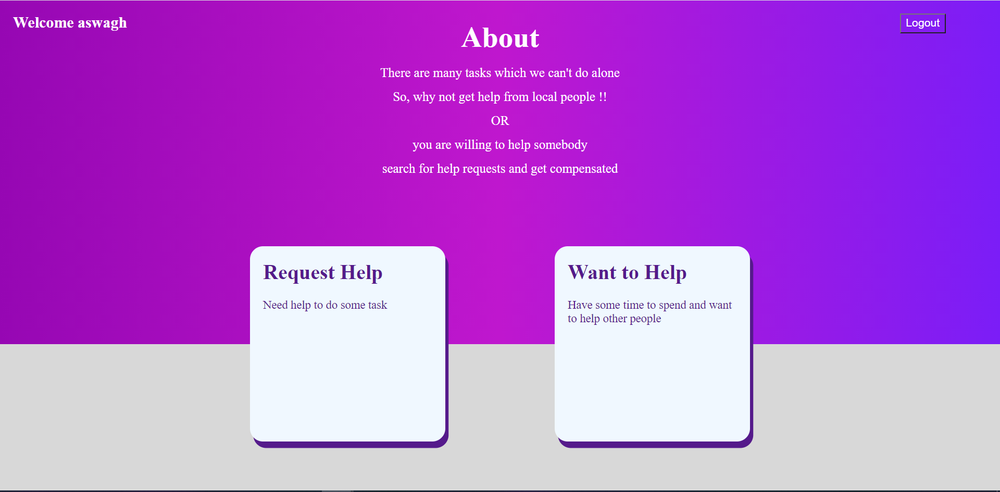
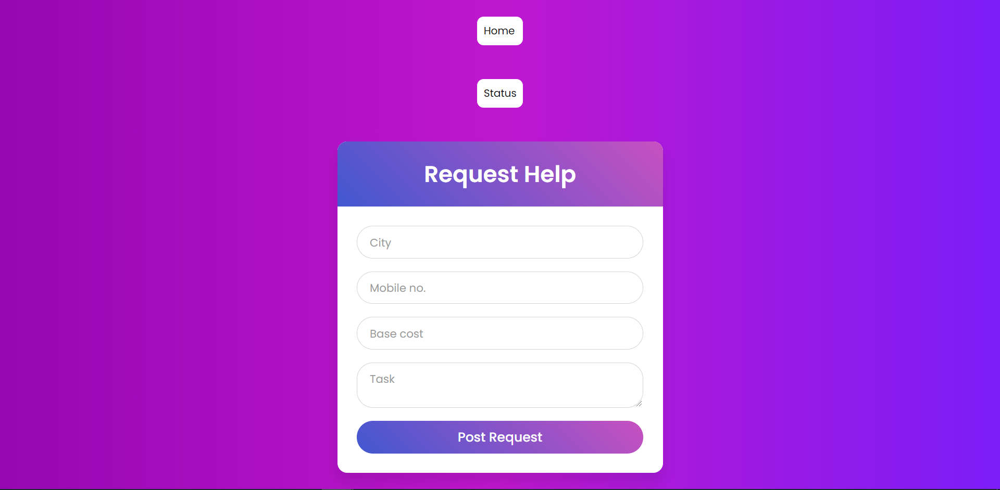
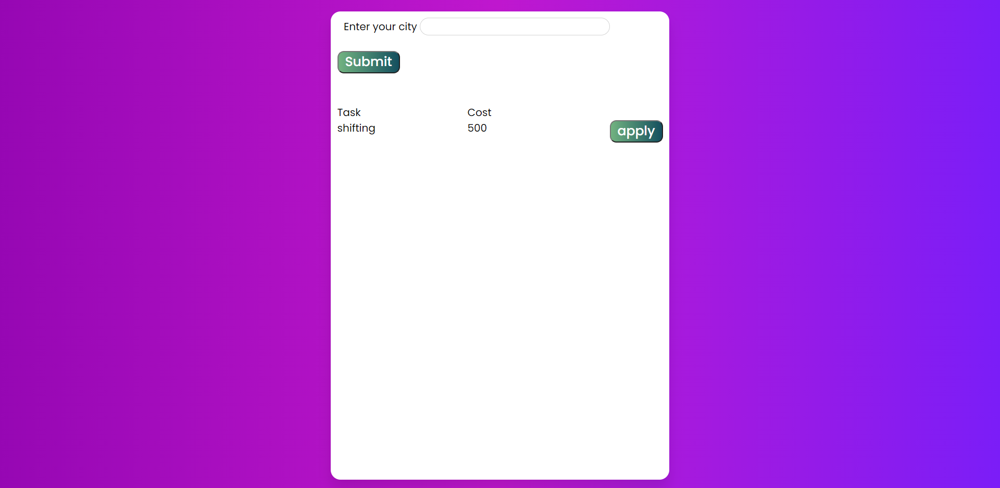
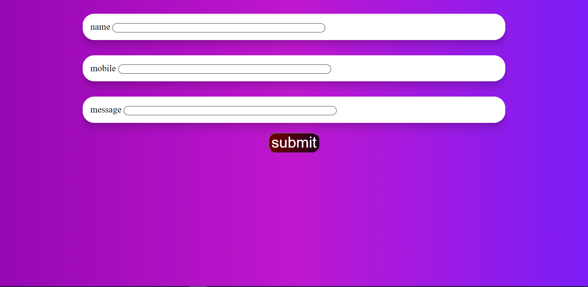

# Helper for any task

We need help with many task in our daily life ,but in today's world it is hard to find a right person who is willing to help us. 
Using our web application, the user can post a request containing information about the task, city and the cost , he or she is willing to pay after completion. when the user posts a particular request, the other users can view the request according to the city they are in and apply for the request along with a particular message they want to send the client( related to cost or task). The client can view the applications in the request status which will showcase the applicant's name, mobile number and message and then the client can accept whichever request he finds fit for the job.

Our application can serve as a way for people to help others where they can negotiate about the price among themselves. As there aren't many task specific professional people. The Task may vary from shifting of furniture to cutting some overgrown tree to washing cars to anything!!

There are many things many things that elderly people need help with such tasks may include buying medicine , shifting some furniture etc.
## interface 

